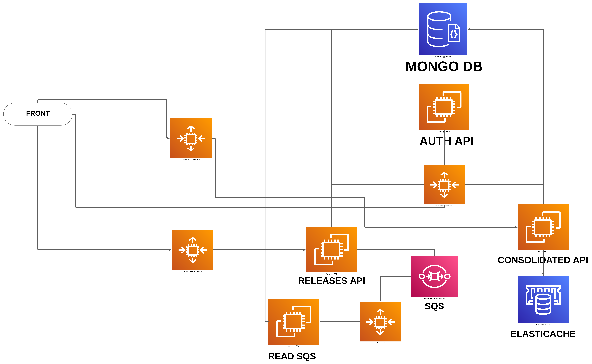
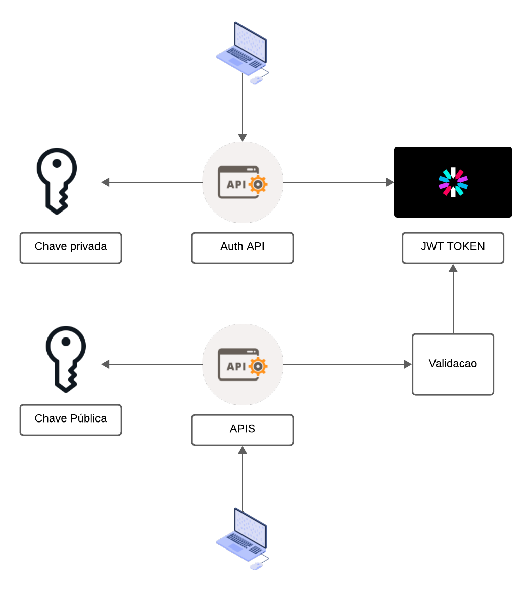
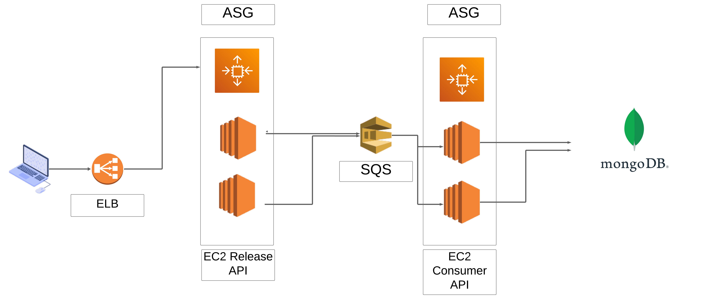
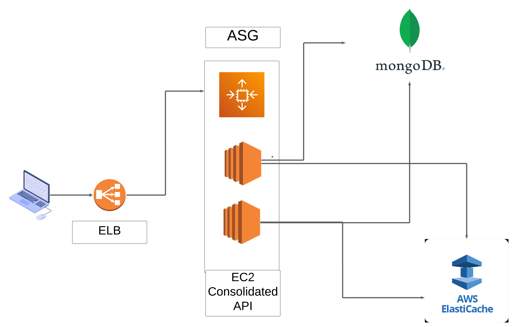

# DailyFlow

O DailyFlow é um serviço que gerencia o controle de lançamentos e a consolidação de transações, incluindo créditos e débitos, e fornece um relatório consolidado diário. O serviço é composto por 3 APIs, cada uma responsável por uma parte do processo.

## Pré-requisitos

Certifique-se de que as seguintes ferramentas estão instaladas:
- **Docker**: Para a contêinerização.
- **Docker Compose**: Para gerenciar os containers
- **.NET**: O serviço foi desenvolvido com .NET.
- **AWS CLI**: Para gerenciar serviços da AWS, como o SQS localmente.



## AUTH API

A **Auth API** lida com a autenticação do usuário. Ela recebe um nome de usuário e verifica se está registrado na base de dados. Vale ressaltar que a autenticação por senha ainda não está implementada, mas é recomendada para futuras melhorias, assim como a implementação de um mecanismo de refresh token.


## Releases API

A **Releases API** é responsável pelo processamento dos lançamentos (créditos e débitos). Cada lançamento exige uma descrição e um valor:
- Valores positivos são considerados créditos.
- Valores negativos são considerados débitos.


A API utiliza autenticação JWT para verificar a empresa e o usuário que está realizando o lançamento. Após receber os dados, o lançamento é enviado para uma fila SQS para processamento assíncrono. 
São executadas duas instâncias do leitor da fila para demonstrar a escalabilidade, garantindo que cada mensagem seja processada por apenas uma instância.

## Consolidated API

A **Consolidated API** agrega todos os lançamentos do dia, calculando o total de créditos, débitos e o saldo geral do dia.

Para otimizar o desempenho, a API armazena o primeiro resultado em um cache Redis, que é válido por 10 minutos. A duração do cache é facilmente configurável.

OS dados vão para um base MONGODB

## Evitando Sobrecarga na Validação do Usuário

Para garantir a segurança das transações e evitar sobrecarga na base de dados durante a validação do usuário, foi adotada a autenticação via JWT. Esse modelo permite centralizar a autenticação e validar tokens em qualquer API backend sem a necessidade de consultar novamente a API de autenticação ou a base de dados.

Para isso, o JWT é assinado utilizando um par de chaves RSA: a AUTH API possui a chave privada, responsável por gerar os tokens, enquanto as demais APIs utilizam a chave pública para validar os tokens recebidos.



## Evitando Sobrecarga no fluxo de caixa

Para melhorar a escalabilidade e eficiência do sistema, adotamos um fluxo assíncrono para processar as requisições de forma otimizada.

O processo proposto consiste em receber a requisição e enviá-la para uma fila de processamento, garantindo que operações mais pesadas sejam tratadas em background sem bloquear o fluxo principal.

A tecnologia escolhida para essa fila foi o Amazon SQS, uma solução gerenciada da AWS que permite a comunicação assíncrona entre sistemas, oferecendo escalabilidade automática e alta confiabilidade.

Com essa abordagem, as APIs focam apenas na autenticação do usuário, enquanto o processamento ocorre de forma independente, reduzindo o tempo de resposta ao front-end e melhorando a experiência do usuário. Para acompanhar o status do processamento, é possível utilizar notificações ou consultas periódicas ao back-end.

A requisição do front vai passar por um ELB, que vai balancear as requisições entre os containers que o ASG subir

O SQS também vai redirecionar o item da fila para apenas uma instância que estiver online escalonada por outro grupo de ASG para os consumers da fila.

e todos os dados serão salvos em uma base de dados Mongo DB hospedada no 
MongoDB Atlas pois já garante:

 - Replica Sets
 - Backups Automáticos e Snapshots
 - Armazenamento Durável com Journaling
 - Failover Automático



**Melhorias**

Implementar um fluxo de refresh token de curta duração para renovar a autenticação de forma segura.
Criar um mecanismo de revogação de tokens para invalidar os refresh tokens comprometidos ou desnecessários.


## Evitando Sobrecarga no fluxo de consolidados

O Consolidados vai na base de dados do mongo buscar os dados do dia, feito a primeira consulta, vai gerar um cachê no **elasticache** para as demais consultas. o tempo de cache pode ser configurado.



## Segurança

Na AWS, para garantir que os EC2s sejam acessados externamente apenas através do Elastic Load Balancer (ELB), é possível criar regras de rede específicas. Para isso, você pode configurar uma VPC personalizada com sub-redes adequadas, de modo que a comunicação entre os EC2s seja permitida internamente e apenas o tráfego vindo do ELB seja autorizado. Além disso, os acessos ao SQS e ao Redis devem ser restritos à rede interna, impedindo o acesso via internet. O ELB já vem com a configuração padrão de segurança do AWS Shield Standard, que oferece proteção contra ataques DDoS.

## Monitoria

É possível utilizar o AWS CloudWatch Logs para monitorar e registrar os logs de eventos, erros e outros dados importantes. Além disso, o AWS CloudWatch Dashboard pode ser configurado para fornecer uma visualização detalhada e customizável dos erros e métricas dos serviços, facilitando a detecção e resolução de problemas. Com o CloudWatch, você consegue automatizar alertas para notificar sua equipe de incidentes e anomalias, proporcionando uma monitoria eficaz para a infraestrutura.

### Para rodar a API e o leitor da fila:

```bash
$ docker compose -f docker-compose.yml up -d --force-recreate --build

$ aws --endpoint-url=http://localhost:4566 sqs create-queue --queue-name testQueue
```

# Postman

O aquivo <b>RELEASES.postman_collection</b> quando carregado no POSTMAN, disponibiliza 3 endpoints para teste
 - Lançamentos
 - Consolidados
 - Autenticação